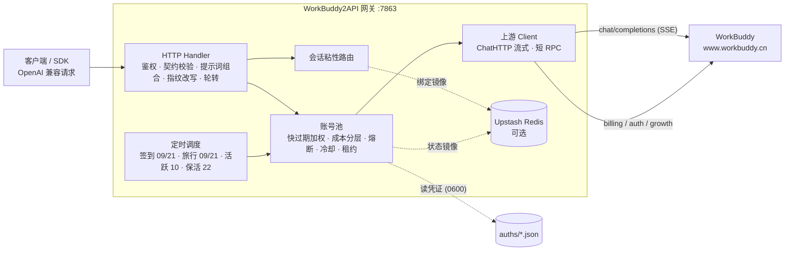

# Fork 差异能力记录

本 fork 相对上游主线的**能力差异清单**：哪些行为是 fork 特有的、改在哪些文件、
回主线时不要恢复什么。

- **上游仓库**：`https://github.com/linguo2625469/workbuddy2api-panel`
- **比对基准 Commit**：`e05edb7`
- **同步方式**：以该基准做 rebase 或 cherry-pick；冲突集中在「挂载点」列出的少数文件。
- **共同原则**：新增能力自成一体（独立包/文件），既有代码只在少量挂载点插入调用。

> 上游仓库已删除。本记录同时充当「本仓库与上游最后一次同步差异」的存档。

---

## 1. 差异能力一览

| # | 能力 | 行为差异 | 默认 |
| --- | --- | --- | --- |
| 1 | **转发契约（严格、不改写）** | 不再改写请求内容：删除系统提示词指纹清洗、内容拦截降级重试、DeepSeek 自动开思考/补档、effort 降抬档、GPT `max_tokens` 抬升、工具历史合并重排删除、schema pattern 改写。未知字段与大整数完整保留；无法表达的输入明确返回 400 | 生效（无开关） |
| 2 | **响应统一管线** | 流式与非流式共用同一 SSE 解析与完成判定；HTTP 错误与 `error` 帧同一分类；按 choice index 独立聚合；工具名增量拼接；错误帧/截断不再伪装成功；新增首个模型事件/首个生成/尾部阶段超时 | 生效 |
| 3 | **重试与账号策略** | 仅「明确未受理」才换号；已生成/已提交一律不重放；限流与配额不跨账号绕过；仅真实完成才记成功、清模型负缓存、绑粘性 | 生效 |
| 4 | **系统提示词体系** | 四种组合位置（`none`/`replace`/`after`/`append`）+ 内置预设库 + 按账号域覆盖 + 面板预览 | `none` |
| 5 | **出站指纹改写层** | 改写 user/assistant/tool/推理/工具入参里的已知指纹串（内置 7 类 + 自定义规则） | `false` |
| 6 | **分域身份与 UA** | 按 `realm × 用途`（chat/refresh/catalog/billing/banner/desktop）生成版本、产品名、Origin、语言与 UA；不随代理域名变化；修复 refresh 丢失 realm；带凭据请求不跟随重定向；refresh token 不出现在 chat 头 | CN `5.7.6`/CLI `2.156.0`、Global `5.6.2`/CLI `2.147.0` |
| 7 | **缓存键** | `prompt_cache_key` 改为 HMAC 派生（持久化 secret），无显式会话则不生成；客户端显式值保留 | 生效 |
| 8 | **配置容错** | 未知/旧键忽略并告警（启动日志 + 面板），保存时直接丢弃；仅「已识别键的值非法」报错；`config_version: 2` | 生效 |
| 9 | **Web 管理面板** | 内嵌单页应用（明暗主题，七个视图）：账号运维 / 用量与积分分析 / 模型档位查询 / 在线改配置（热生效）/ 运行日志 / 任务中心 | 生效 |
| 10 | **积分任务体系** | 任务列表/接受/领取 + 「一键完成」覆盖 17 个成长任务（纯 API）；任务中心全账号扫描 + 执行队列 | 生效 |
| 11 | **出站代理** | 普通正向代理 + Resin 粘性代理池 + 账号级代理开关 | 未配置 = 不接入 |
| 12 | **裸模型名默认域** | `model_default_realm = cn / global / auto` | `cn` |
| 13 | **客户端特征对齐** | 稳定设备/会话指纹、硬件特征离散化、`/v2/report` 桌面指纹、版本自检 | 启用 |
| 14 | **面板版本配置** | 占位符来自后端内置基线（不硬编码）；「一键填入已拉取版本」；CLI 版本需人工核对并给出版本不成对提醒 | 生效 |

---

## 2. 转发契约（严格、不改写）

上游请求在出站前只做**契约校验与编码**，不再做内容改写：

```go
// internal/upstream/client.go
func (c *Client) prepareBody(body []byte, realm, uid, conversationID string) ([]byte, error) {
	r, err := forwarding.Parse(body)
	if err != nil {
		return nil, err
	}
	if l := c.Fingerprints.Load(); l.Dirty(body) { // 可选层，默认关闭
		l.Object(r.Object)
	}
	return r.Encode(r.Model)
}
```

`internal/forwarding` 负责输入契约（`Parse` + `Encode`）：

- **严格校验已知字段**：未知扩展字段原样保留；不修复历史（孤儿 tool_call 不再被清理）；
- **大整数安全**：走 `internal/jsondoc` 的 `json.Number` 解码，`9007199254740993` 这类值不再被 float64 截断；
- **无法表达即 400**：旧 `function`/`function_call` 协议直接拒绝，而不是静默转换；
- **出站编码**：强制 `stream:true`、补 `stream_options.include_usage`、`max_completion_tokens`→`max_tokens`（值精确保留）、`tool_choice` 对象→字符串、`reasoning.effort` 归一；
- **请求体上限 32 MiB**（`http.MaxBytesReader`，超限 413）。

### 重试与账号策略

| 场景 | 行为 |
| --- | --- |
| 传输层错误 | 直接 502 `upstream_transport`，**不换号重放**（受理状态未知，重放可能重复生成） |
| `ErrModelBlocked`（11102） | 唯一允许换号的分支（明确的前生成期拒绝） |
| `ErrBadParams` / `ErrClient` | 立即透传上游原文回 400，不轮转 |
| `ErrContentBlocked` | 立即回 400 + `error.gateway_hint`，不罚号、不轮转、不自动改写提示词 |
| `ErrPromptTooLong` / `ErrImageInvalid` | 请求级错误，不罚号、不轮转、透传原文 |

---

## 3. 系统提示词体系

客户端（Claude Code / Codex 等 CLI）会在 system prompt 注入固定模板句，上游内容审核按**逐字精确匹配**误杀合法流量。网关在出站前对 system/developer 做一次可配置的**组合**。

### 3.1 组合位置（`prompt.mode`）

| 模式 | 语义 | 客户端 system |
| --- | --- | --- |
| `none`（默认） | 不改写，逐字透传 | 保留 |
| `replace` | 删除全部 system/developer，只留网关提示词（指纹面最小） | **丢弃** |
| `after` | 网关提示词置首，客户端开头连续块紧随其后（**后组合**） | 保留（在网关之后） |
| `append` | 客户端开头连续块在前，网关提示词插在其后 | 保留（在网关之前） |

> `after` 与 `append` 互为镜像：都逐字保留客户端内容，只差谁先被模型读到。需要「网关指令优先、同时不丢客户端工具约定」时用 `after`。**`append` 不能解决 11128**（客户端原文在场）。

实现：`internal/prompt/prompt.go` 的 `Compose`（分派 `Rewrite` / `ComposeAfter` / `Append`）。

### 3.2 内置预设（`prompt.preset`）

目录 `internal/prompt/presets/`，命名约定 `<name>.md`（分域共用）或 `<name>.<realm>.md`（分域），注册表在 `preset.go`——新增预设只需放文件 + 登记一行，面板自动列出（前端不硬编码名单）。

| 预设 | CN / Global | 适用 |
| --- | --- | --- |
| `default` | 820 / 820 字（中英共用） | 通用工程助手 |
| `minimal` | 173 / 400 | 极简，量级对齐官方 Quick 模式模板 |
| `coding` | 519 / 1395 | 编码代理：工具纪律 + 最小改动 + 自证闭环 |
| `tool-agent` | 513 / 1372 | 函数调用：schema 精确、参数不猜、不叙述调用细节 |
| `assistant` | 433 / 1188 | 通用问答/写作，非工程向 |

预设正文均刻意避开已知指纹串，有测试守护（`TestPresetCatalogComplete`）。

### 3.3 素材优先级与分域覆盖

**素材来源**：`prompt.text`（内联正文）> `prompt.file` > `prompt.preset`。

**分域覆盖**（同一网关同时对 CN 与 Global 使用不同提示词）：

```jsonc
"prompt": {
  "mode": "after",
  "preset": "coding",
  "profiles": {
    "cn":     { "mode": "replace", "preset": "minimal" },
    "global": { "text": "You are …" }
  }
}
```

两层语义刻意不同：

- `mode` **逐项回落**顶层（行为开关通常两域一致）；
- 素材（`preset`/`file`/`text`）**整体覆盖**——某域只要显式设了任意一项，该域素材就完全由自己的三项决定，不会「半继承」出「设了 minimal 却仍用顶层 text」的结果。

### 3.4 面板与预览

`POST /panel/api/prompt/preview` 解析草稿返回各域生效正文 + 来源 + 字数 + 告警，保存前即可核对。改动需重启（`PromptRules` 在装配期构建）。

---

## 4. 出站指纹改写层（`fingerprint_rewrite`）

`prompt.mode` 只作用于 system/developer，下面这些通道清不掉：用户粘帖报错原文、终端/工具回显、工具入参、思维链字段、项目规则文件。这一层逐字改写它们。

### 4.1 内置 7 类指纹（启用即含，不可单独关闭）

| # | 指纹串 | 触发条件 | 处置 |
| --- | --- | --- | --- |
| 1 | `x-anthropic-billing-header` | 只看键名不看值；带冒号键值段整段触发；**裸键名也触发** | 键值段整段删除；残留裸键名缩写为 `-hdr` |
| 2 | `cc_<name>=<value>;` | 尾随裸键值（#1 的值部分）；单独出现也拦 | 循环剥离 |
| 3 | `You are Claude Code, Anthropic's official CLI for Claude` | 匹配不含结尾标点（CLI `.` 收尾 / 桌面 `,` 接后缀，两者都覆盖） | 一词替换 `CLI for Claude`→`CLI tool for Claude` |
| 4 | `Main branch (you will usually use this for PRs)` | 逐字整句 | 一词替换 `Main`→`Default` |
| 5 | `You are a coding agent running in the Codex CLI, a terminal-based coding assistant.` | Codex 三句模板首句（三句缺一不可） | 一词替换 `Codex CLI,`→`Codex CLI tool,` |
| 6 | `To give feedback, users should report the issue at https://github.com/anthropics/claude-code/issues` | **需整句同现**（只留链接或半边不拦） | 一词替换 `give`→`provide` |
| 7 | `11128` | **与上下文无关**；相邻 `11148`/`11101`/`11115`/`99999` 均放行 | 改写为 `11-128` |

> 第 7 条是自指的：`11128` 是本类拦截自身的错误码，上游据此识别「在讨论/回显其内部错误码」的请求。**把 11128 报错原文粘进对话问模型，这个动作本身就会再触发一次。**

覆盖通道：`messages[].content`（字符串与多模态 text part）、`reasoning_content`、`reasoning`、`tool_calls[].function.arguments`、`tool` 结果 content。**image/audio part 数据不动**。

### 4.2 自定义规则（`fingerprint_rules`）

在内置 7 类之上**叠加**（"加入"而非"替换"），两种匹配 × 两种动作，刻意不做正则（正则既是配置注入面——灾难性回溯——也是性能坑）：

| 面板写法 | JSON | 匹配 | 动作 |
| --- | --- | --- | --- |
| `匹配串 => 替换文本` | `{"match":"…","replace":"…"}` | `literal`（大小写敏感） | 替换 |
| `/匹配串 => 替换文本` | `…"mode":"fold"` | `fold`（忽略 ASCII 大小写） | 替换 |
| `!匹配串` | `…"action":"remove"` | `literal` | 整段删除 |
| `/!匹配串` | fold + remove | `fold` | 整段删除 |

上限 256 条、匹配/替换各 512 字节。非法规则（空/纯空白/未知 mode/`replace` 含 `match`）在**保存时被拒并点名第几条**。改动**热生效**（`atomic.Pointer` 整体替换层），无需重启。

### 4.3 实现设计（`internal/scrub`）

历史实现（已删除的 `internal/upstream/sanitize.go`）在**每条消息的每段文本**上跑 7×`strings.Contains` + 1 个 `(?i)` 正则预检，命中后 5×`ReplaceAll` + 3 个正则 + 一个 `cc_` 定点循环。**多数请求没有任何指纹，却要全额付遍历 + 正则的钱。**

实测（Go 1.26 / i9-14900HX；2KB 文本 / 10 条消息典型请求）：

| 路径 | 旧实现 | 新实现 | 提升 |
| --- | ---: | ---: | ---: |
| 干净 2KB 文本 | 23,285 ns（0 alloc） | **941 ns**（0 alloc） | **24.7×** |
| 干净典型请求（10 条消息） | 217,492 ns（9 alloc） | **8,798 ns**（0 alloc） | **24.7×** |
| 命中 2KB 文本 | 51,076 ns | 3,419 ns | 14.9× |
| 100KB 请求体预检 | —（无此层） | 24.8 µs（12.6 GB/s，0 alloc） | — |

重排为「先证伪、再精确定位」：

| # | 手段 | 效果 |
| --- | --- | --- |
| A | **请求体级哨兵预检**：整包 `bytes.Index` 扫 5 个必要子串（`nthropic`/`NTHROPIC`/`cc_`/`Main branch (`/`Codex CLI`/`11128`） | 任一不中即判定"确定干净"→ 不解析、不遍历、零分配。哨兵是**超集条件**（有测试守护） |
| B | **单遍改写**：字面串合并为一个 `strings.Replacer`（trie，单次扫描） | 5 次 `ReplaceAll` → 1 次 |
| C | **零正则**：header 键值段与尾随 `cc_` 由一次手写字节扫描处理 | 3 个正则 → 0 |
| D | **不做全局 `TrimSpace`**：只消费被删除段落的尾随空白 | 修掉"改写顺带删掉用户正文首尾空白"的语义副作用 |
| E | **自定义规则**预编译为独立 `Replacer` + 哨兵表 | 热改无需重启 |
| F | **零分配干净路径**：按类型就地分支（不用 `content(any) (any, bool)` 这类会装箱的签名） | 9 alloc → 0 |

失败方向是 **fail-open**：漏判只等于"这一层没生效"，绝不阻断或改写无关内容。

接入点选在 `prepareBody` **同一次 `Parse` 之后**：不额外解析、不额外序列化，不改变严格转发契约。

### 4.4 代价（必须知情）

这一层**会修改用户可见内容**（对话里的 `11128` 变成 `11-128`、命中的词句被替换）。它只解决"上游逐字拒绝"，不是内容治理；默认关闭，按需开启。

---

## 5. 其他新增能力

### 5.1 Web 管理面板

`internal/panel`，前端 `go:embed` 单文件进二进制，零外部依赖。明暗主题，七个视图：

| 能力 | 说明 |
| --- | --- |
| 账号池可视化 | 健康色条 / 积分量条 / 冷却倒计时 / 模型锁；单号运维（复活 / 禁用 / 暂停 / 代理开关 / 签到 / 查余额 / 移除） |
| 浏览器内 OAuth 添加账号 | 面板「添加账号」完成设备授权 → 凭证落盘 → **热加载进池（免重启）**，替代命令行 `login.sh` |
| 在线配置编辑（热生效） | 改 `config.json`：API 密钥 / `soft_rate` / 池参数 / 任务排程 / **提示词 / 指纹规则**立即生效；装配期字段保存后提示需重启。写入采用深合并 + 原子替换 |
| 请求指标与日志 | 完成成功率 / HTTP 成功率 / 平均耗时 / 最近请求；运行日志带**调用来源 IP·UA** 与时间区间筛选；JSONL 只归档请求元数据，不写提示词、响应正文或凭证 |
| 用量与积分分析 | 积分到期分布、包构成、按维度聚合 |
| 模型档位查询 | `/v1/models` 的 `supported_efforts` / `default_effort` / 积分倍率 / 输入输出上限条件查询 |
| 任务中心 | 全账号任务扫描 + 执行队列 + 开学季状态卡；日志分「任务 / 对话 / 系统」三频道 |

### 5.2 积分任务体系与「一键完成」

任务列表 / 接受 / 领取接口 + 面板弹窗。「一键完成」覆盖 **17 个成长任务**，推进进度、等待异步计分落定后**自动领奖**，纯 API 零客户端依赖：

`first_buddy`（领养）、`create_canvas`、`chat_5`、`Model_chat_GLM5.2`、`RichMeow_Chat`、`Buddy_App`、`Buddy_App_QQ`、`automation_1`、`Library_read`、`template_5`、`playbook_prompt`、`expert_5`、`Expert_team_use_3`、`Hp_Appearance`、`Expert_lighthouse`、`skill_1`（+ 小程序首对话 / 开学季）。

不可自动的 1 个：`Expert_Philanthropy`（需真实捐款，服务端领奖校验捐赠回执）。

任务计分走 `/v2/report` 行为上报，但**不同任务认不同客户端指纹**：CLI 指纹（`www.codebuddy.cn`）、桌面指纹（`copilot.tencent.com` + `WorkBuddy/5.5.6` UA + `workbuddy-desktop` 事件族）、web 指纹（`www.workbuddy.cn` + `x-client-platform: web`）。网关为每类任务构造对应指纹的判据事件链（`internal/upstream/desktop.go`）。

### 5.3 其余

| 能力 | 说明 |
| --- | --- |
| 首启自动生成配置 | 无 `config.json` 时自动生成推荐配置（含 `crypto/rand` 随机 `api_key`），双击即开 |
| 粘性会话内容回退 | 客户端不发 `conversation_id` 时，用 `system + 首条 user` 哈希派生会话键（`d-` 前缀） |
| 余额后台刷新 | `schedule.balance_refresh_minutes`（默认 5）周期查余额，冷却账号余额恢复自动解冻 |
| 模型能力透出 | `/v1/models` 附带上游真实字段（efforts / 积分倍率 / 上限） |
| 裸模型名默认域 | `model_default_realm`（`cn`/`global`/`auto`）；显式 `cn:`/`global:` 前缀恒优先 |
| 出站代理 + 账号级开关 | `proxy_url` 支持 `http`/`https`/`socks5(s)`；每账号 `use_proxy`（面板可切换） |
| 领养前置修复 | 上游 `travelAdopt` 缺 report 前置导致领养恒失败于 `first_buddy task not completed yet`；修正后实测 +300 到账（3/3 账号） |
| 安全加固 | 常量时间密钥比较（`internal/httpauth`）、CSP 与安全响应头、UID 白名单防路径穿越、前端属性转义修复 |

---

## 6. 相关改动位置（挂载点）

| 能力 | 主要文件 |
| --- | --- |
| 转发契约 | **新增** `internal/forwarding/`、`internal/jsondoc/`；**删除** `internal/upstream/{payload,thinking,sanitize,tool_pairing}.go` |
| 响应管线 | `internal/upstream/sse.go`（重写）、`internal/upstream/idle.go` |
| 重试与账号策略 | `internal/server/handler.go`、`internal/upstream/client.go`（**删除** `internal/server/degrade.go`） |
| 系统提示词 | **新增** `internal/prompt/{prompt,preset}.go` + `internal/prompt/presets/`、`cmd/server/prompt_config.go`、`cmd/server/prompt_preview.go` |
| 指纹改写 | **新增** `internal/scrub/`（`scrub.go` 内置 / `rules.go` 自定义 / `layer.go` 入口） |
| 分域身份与 UA | **新增** `internal/upstream/identity.go`、`internal/auth/snapshot.go`；`internal/upstream/{headers,client,desktop,global_models,hint,usage}.go` |
| 缓存键 | `internal/upstream/cache_key.go`、`cmd/server/main.go`（加载 `cache-secret`） |
| 配置容错 | `cmd/server/config.go`、**新增** `cmd/server/config_warnings.go`、`config.example.json` |
| 出站代理 | `internal/proxy/`、`internal/auth/auth.go`（账号级开关） |
| 裸模型名默认域 | `internal/server/resolve_model.go` |
| 客户端特征对齐 | `internal/upstream/{headers,desktop,version_check}.go` |
| 面板 | `internal/panel/{index.html,app.js,config.go,panel.go}` |

**挂载点（冲突最可能）**：`internal/upstream/client.go`、`internal/upstream/headers.go`、
`internal/server/handler.go`、`cmd/server/{config,main}.go`、`internal/panel/{index.html,app.js}`。

---

## 7. 合并注意

**回主线时不要恢复已删除的模块**：`upstream/payload.go`、`upstream/thinking.go`、
`upstream/sanitize.go`、`upstream/tool_pairing.go`、`server/degrade.go` 及其测试。
这些文件的职责已被 `internal/forwarding/`、`internal/upstream/sse.go`、
`internal/prompt/`、`internal/scrub/` 取代。

**配置不兼容点**（旧配置**不识别、不迁移**：启动时告警、面板保存时直接丢弃）：

| 旧键 | 替代 |
| --- | --- |
| `features.sanitize_blacklist_fingerprints` | `fingerprint_rewrite` + `fingerprint_rules` |
| `upstream.user_agent` / `client_version` / `cli_version` | `upstream.profiles.<realm>.*` |
| `prompt.mode: custom` | `prompt.mode: replace`（旧值现为非法，直接报错） |
| `prompt.mode: passthrough` | `prompt.mode: none`（同上） |

其余默认值变更：`upstream.chat_base_cn` → `https://www.workbuddy.cn`。

**需要留档的未验证项**：默认 chat 端点与 profile 头、`max_completion_tokens` 映射、
`tool_choice` 的 none/required/具名、思考关闭编码与 effort 档位、`n>1`、logprobs、
JSON Schema、图片、工具名增量方言。静态检查与离线测试不能替代真实上游验收。

---

## 8. 验证

```bash
go test ./... -count=1
go vet ./...
go test -race ./internal/server ./internal/upstream ./internal/forwarding ./internal/scrub
```

---

## 附 A：架构总览



## 附 B：关键断言 ↔ 代码出处

| 断言 | 出处 |
|---|---|
| `prompt.mode` 默认 `none` | `cmd/server/config.go` Default() |
| 四种组合位置实现 | `internal/prompt/prompt.go`（Compose/ComposeAfter/Append/Rewrite） |
| 内置预设目录与分域文件 | `internal/prompt/preset.go` + `internal/prompt/presets/` |
| 素材优先级 text > file > preset | `internal/prompt/prompt.go` Resolve |
| 分域规则构建（mode 回落 / 素材整体覆盖） | `cmd/server/prompt_config.go` |
| 指纹改写入口与预检 | `internal/scrub/layer.go`（Dirty/Object）、`scrub.go`（Sentinel） |
| 指纹改写接入点 | `internal/upstream/client.go` prepareBody |
| 请求体上限 32 MiB | `internal/forwarding/request.go` MaxRequestBytes |
| 6004 模型级限流 code 与重置时间解析 | `internal/upstream/client.go:127`、`:147` |
| session-dead 连续阈值 3 才禁用 | `internal/pool/pool.go`（`sessionDeadThreshold`） |
| 硬冷却至次日 04:00 | `internal/pool/pool.go`（`CooldownUntilTomorrow4AM`） |
| 软冷却退避封顶 2h | `internal/pool/pool.go`（`defaultSoftRateMax`） |
| `activity_hours` 默认 `[10]` | `cmd/server/config.go` |
| 活跃自检回读 streak | `internal/scheduler/scheduler.go`（`checkActivityStreak`） |
| Redis 粘性镜像 7 天 TTL | `internal/redisstore/redisstore.go` |
